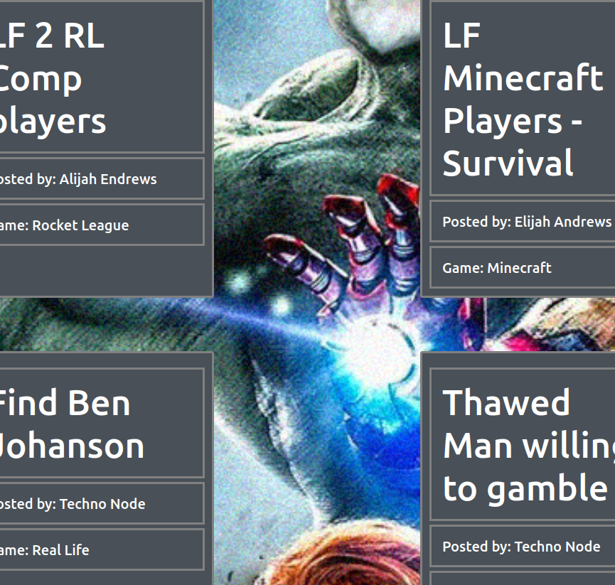
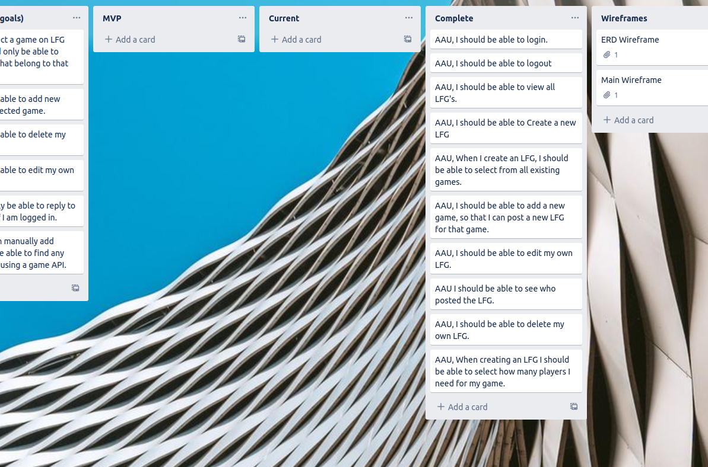
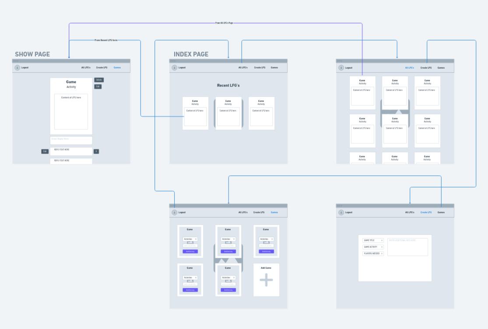
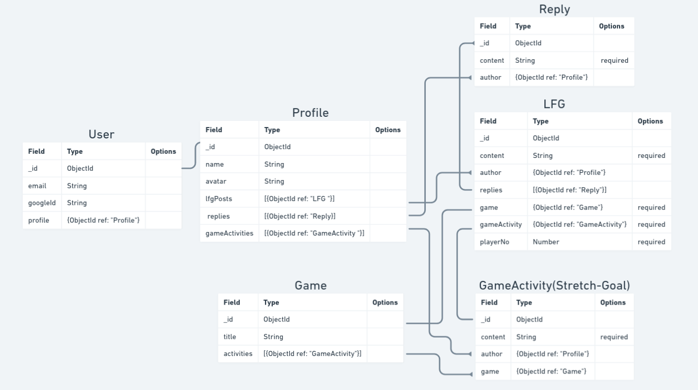

# Gamers Assemble

##  Description 
A MEN-Stack software for gamers that utilizes MEN-Stack and Google-OAuth. The primary functionality and focus of this application is to allow gaming users to find a group to play any game with.

## Planning Materials
 Trello Board: 

 https://trello.com/b/yOc9emeO/unit-2-project

WireFrame:

 https://whimsical.com/unit-2-main-wireframe-AtGUsmWx8LLxmH7ZZvGhZ4

ERD: 

https://whimsical.com/unit-2-project-erd-V9MWLsKJE7gwrPCehjx59r

## Technologies Used 
| Node.js | Express.js | Mongoose | MongoDB | Bootstrap | GoogleOAuth | Javascript | HTML | CSS |

## Credits  
Background: Ian Terada, Hunter Long |
Favicon: https://realfavicongenerator.net/

## Deployed URL
[Gamers Assemble](https://gamers-assembly.herokuapp.com/)

## Next Steps 
Once basic application functionality has been implemented, I will refactor the Game model to use API. I will add an activities sub-document that can be added by users to games.